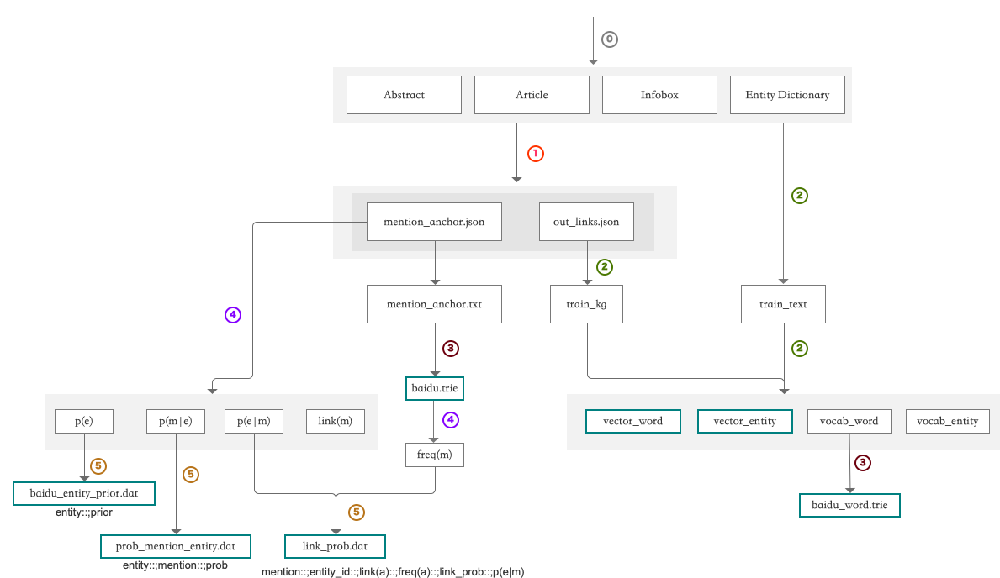

# XLink
Entity Linking System from KEG

## XLink 数据更新工具

数据更新工具从维基百科和百度百科的原始语料中抽取、计算 XLink
需要的目标数据，具体的出流程如图所示，数据处理的完整过程见 `./datatool/main.py`

通过数据更新工具生成的文件对应的 XLink 项目路径详见
[XLink 数据文件汇总 V1](https://github.com/XinruZhang/XLink/blob/master/XLink%20数据文件汇总.md)。

1. 从 raw_corpus 得到 standard corpus。对于 infobox，需要先从 pre_raw_corpus 得到 raw_corpus.
2. 从 standard corpus 中抽取 mention_anchors 和 out_links.
3. 根据 mention_anchors 构建 mention_anchors.trie，用于计算 freq(m)
4. 用 freq(m) 来 refine 第 2 步得到的 mention_anchors
5. 过滤 mention_anchors，过滤掉 link(m)<2, link_prob<0.0001 的 mentions. 得到新的 mention_anchors.
6. 扩展新得到的 mention_anchors，同时得到 title_entities：将 entity 中去掉括号的 title 作为 mention 在 mention_anchors 中出现过，但是该实体本身并没有在文本中以 title 为 mention 被引用过，则将其加入到 mention_anchors 中。
7. 根据 mention_anchors 计算概率，生成字典树和三个概率文件

## 参考文档

\[1\]. [XLink 数据更新文档 V1](https://github.com/XinruZhang/XLink/blob/master/XLink%20数据更新文档.md)

\[2\]. [XLink 数据文件汇总 V1](https://github.com/XinruZhang/XLink/blob/master/XLink%20数据文件汇总.md)

