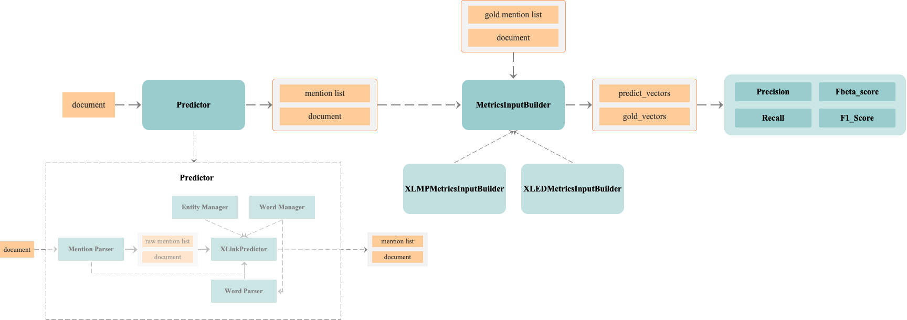

# Evaluation

## Dataset Build Process
This process aims to build a custom dataset rather than format public prevalent datasets, and all modules in Fig are under the directory `./build_dataset`. 

File `./build_dataset/main.py` shows the way of generating custom datasets for evaluation.

## Evaluation Framework
All evaluation dataset should be formatted by 
`evaluation.build_dataset.OutputFormatter.OutputFormatter.format_for_dataset_annotations()`,
and then the formatted dataset can be loaded by
`evaluation.DatasetLoader.DatasetLoader`
 
